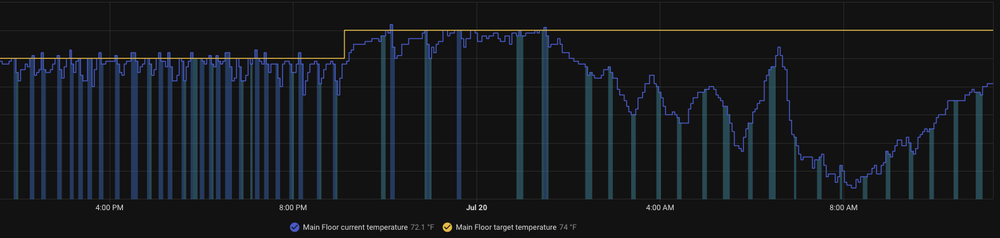
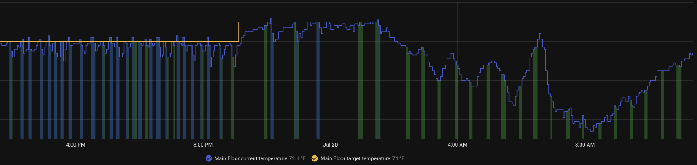

# Brightside Theme
Brightside is a lightweight refinement of Home Assistant’s default theme.

## Current refinements

- Uses a distinct green color for fan-only climate activity, making it easier to distinguish from cooling in History graphs.

## Before and After

### History Climate View
Before

After
